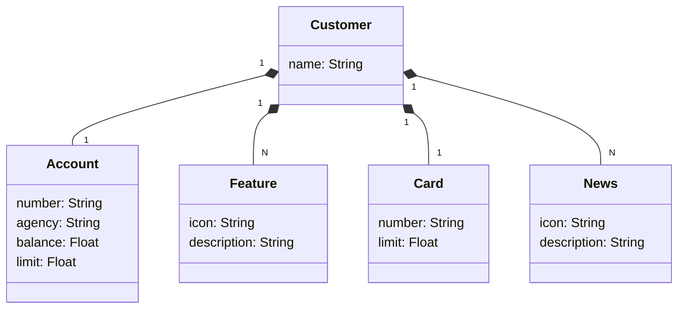

# Backend Santander 2024
API RESTful Java utilizando Spring e afins

## Diagrama de Classes

```mermaid
classDiagram
    class Customer {
        name: String
    }

    class Account {
        number: String
        agency: String
        balance: Float
        limit: Float
    }

    class Feature {
        icon: String
        description: String
    }

    class Card {
        number: String
        limit: Float
    }

    class News {
        icon: String
        description: String
    }

    Customer "1" *-- "1" Account
    Customer "1" *-- "N" Feature
    Customer "1" *-- "1" Card
    Customer "1" *-- "N" News

```
